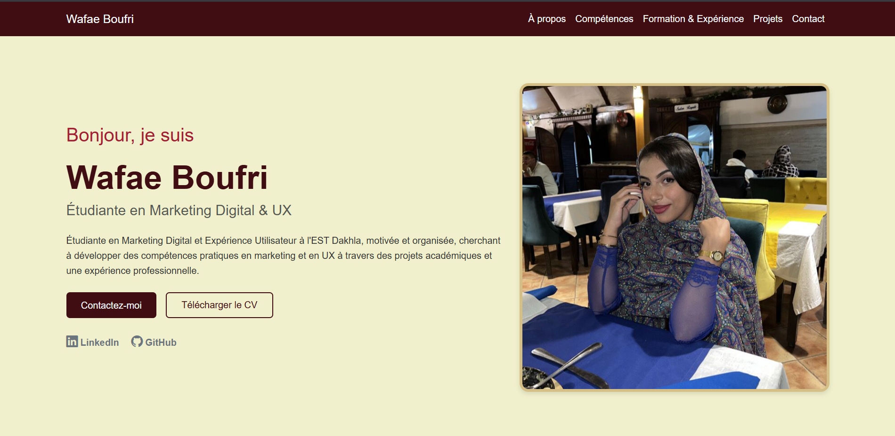
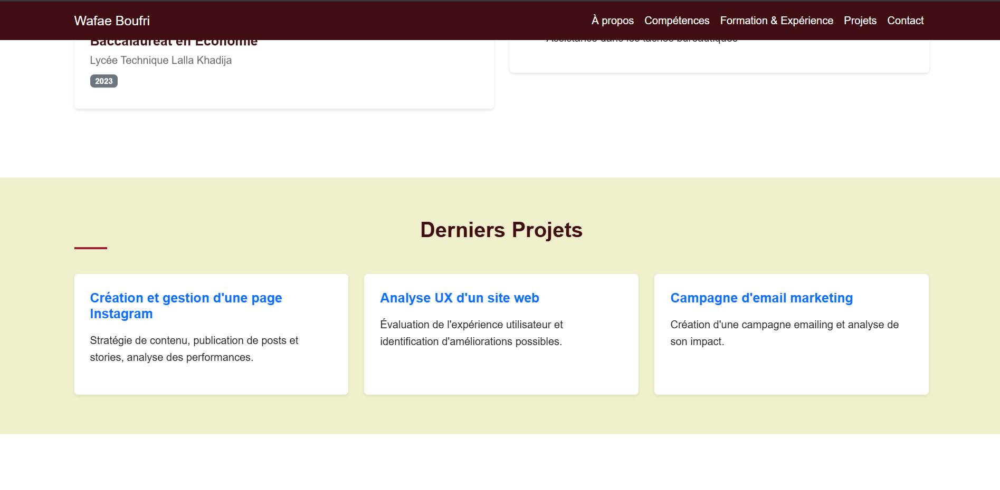
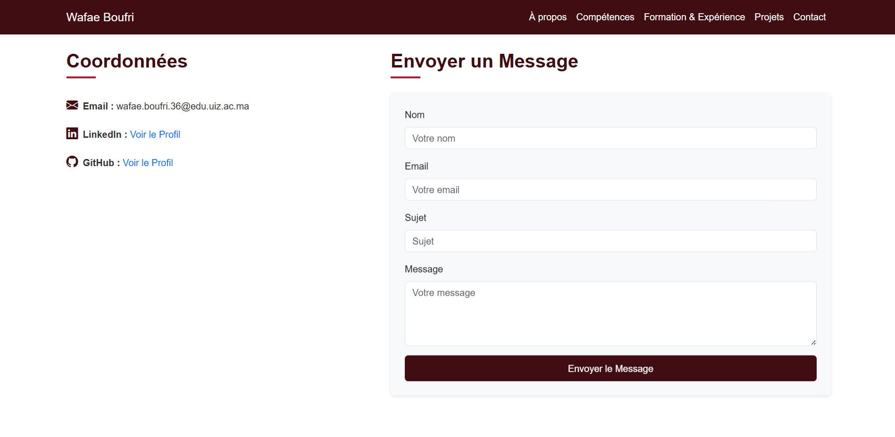

# 🌐 Wafae Boufri — Site Web Portfolio

Un site web portfolio étudiant simple et épuré construit avec **Bootstrap 5** et du CSS personnalisé, conçu pour un projet universitaire.

---

## 📸 Captures d'écran

### Section Accueil


### Section Projets


### Section Contact



---

## ✨ Fonctionnalités

- **Design Responsive** — Mises en page pour mobile, tablette et bureau via la grille Bootstrap 5
- **Contenu Dynamique** — Objet JavaScript `STUDENT_PROFILE` facilement modifiable
- **Thème Personnalisé** — Palette de couleurs simple et épurée utilisant des variables CSS
- **Téléchargement de CV** — Lien direct vers le CV de l'étudiante au format PDF
- **Structure Claire** — Structure HTML facile à comprendre, idéale pour les projets étudiants

---

## 🛠️ Technologies Utilisées

| Technologie | Utilisation |
|---|---|
| **HTML5** | Structure sémantique |
| **CSS3** | Style personnalisé |
| **Vanilla JavaScript** | Intégration des données dans les éléments HTML |
| **Bootstrap 5** | Grille conteneur, barre de navigation, cartes, formulaires, boutons |
| **Bootstrap Icons** | Icônes (LinkedIn, GitHub, Email) |

---

## 📁 Structure du Projet

```text
├── index.html                  # Page principale
├── README.md                   # Documentation du projet
└── assets/
    ├── css/
    │   └── style.css           # Styles personnalisés & variables de couleurs
    ├── cv/
    │   └── CV.pdf              # Document CV téléchargeable
    ├── img/
    │   ├── profile.jpeg        # Photo de profil
    │   └── screenshots/        # Captures d'écran pour le README
    └── js/
        └── main.js             # Logique JavaScript et données du profil
```

---

## 🚀 Utilisation

Pour utiliser et modifier ce portfolio :
1. Ouvrez `index.html` dans n'importe quel navigateur web moderne ou utilisez un serveur en direct (ex: VS Code Live Server).
2. Pour modifier les informations personnelles, l'expérience ou les projets, modifiez simplement l'objet `STUDENT_PROFILE` dans le fichier `assets/js/main.js`.
3. Aucun outil de compilation n'est requis.

---

## 🔗 Liens

- **GitHub :** [https://github.com/wafaeboufri36-bit](https://github.com/wafaeboufri36-bit)
- **LinkedIn :** [https://www.linkedin.com/in/wafae-boufri-76b1033b6/](https://www.linkedin.com/in/wafae-boufri-76b1033b6/)
- **Email :** wafae.boufri.36@edu.uiz.ac.ma
- **Site Web :** [https://wafaeboufri36-bit.github.io/cv-en-ligne-wafae-boufri/](https://wafaeboufri36-bit.github.io/cv-en-ligne-wafae-boufri/)

---

## 📄 Licence

© 2026 Wafae Boufri. Projet de Portfolio Étudiant.
